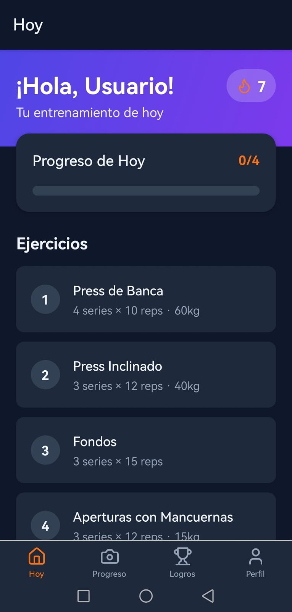
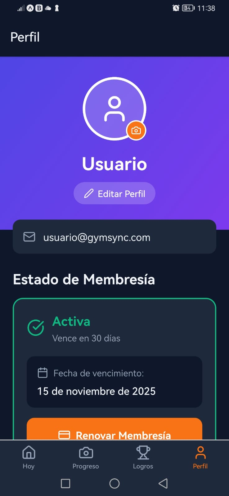

# GymSync - Tu Compañero de Gimnasio

- **Nombre**: Cristhian Aguilar Cerna
- **Curso**: [ I, III-25, P-02]
- **Profesor**: Ever Barahona Mendoza

### Descripción del Proyecto
GymSync es una aplicación para Android pensada para el cliente del gimnasio. El objetivo es que el usuario pueda consultar su rutina diaria, registrar sus avances, ver su progreso en fotos y gestionar su membresía, todo desde el celular.

### Funcionalidades del Usuario

**Requisitos Técnicos:**
- **CRUD:** El usuario podrá gestionar su galería de fotos de progreso, añadiendo nuevas fotos (Crear), viéndolas (Leer), actualizando notas (Actualizar) y eliminando fotos antiguas (Borrar).
- **Listas y Búsqueda:** Se mostrará una lista de los ejercicios de la rutina del día.
- **Cámara:** La función principal será tomar fotos para la galería de progreso personal.
- **Galería:** Permitirá al usuario subir una foto de perfil desde su galería.
- **Diálogos:** Se usarán para confirmar acciones como "Marcar entrenamiento como completado" o realizar el pago de la membresía.

**Funciones Clave de la App:**
- **Mi Plan de Hoy:** Muestra la rutina de ejercicios asignada para el día actual.
- **Registro de Avance:** Permite al usuario anotar el peso o las repeticiones que hizo en cada ejercicio.
- **Mi Progreso Fotográfico:** Una galería personal para que el usuario suba sus fotos y vea su evolución física.
- **Mi Perfil y Pagos:** Muestra el estado de la membresía del usuario y le permite realizar el pago.
- **Rachas y Logros:** Notificaciones que motivan al usuario por su consistencia y esfuerzo.

### Mockups 

- **Pantalla Principal ("Mi Plan de Hoy"):**

- **Pantalla de Perfil y Pagos:**
 

- **Galería de Progreso Fotográfico:**

